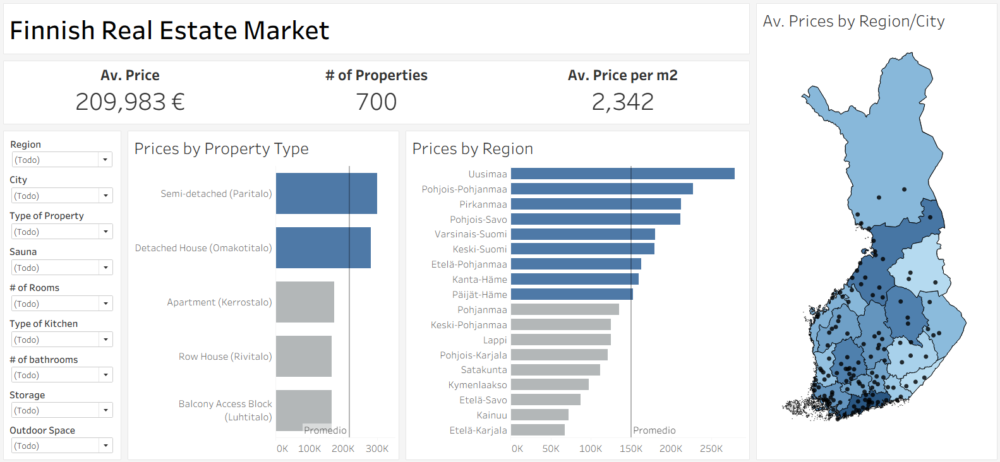

# Finland Real Estate Market Dashboard

An end-to-end data analytics project that scrapes, cleans, and visualizes the Finnish residential housing market using a **Web Scraper**, **Tableau**, and **Excel**

## 🎯 Project Overview
This repository contains a **dynamic Tableau Dashboard** designed to analyze residential property listings across Finland. The project bridges the gap between raw web data and actionable real estate insights, allowing users to explore prices, locations, and property characteristics seamlessly.

## 📊 Dashboard

## ❓ Problem Statement
Real estate firms in Finland face highly fragmented market visibility because property listings are scattered across multiple competitor websites and independent agencies. 

* 🏢 **Hidden Competitor Landscape:** Without a centralized view, firms cannot efficiently monitor rival pricing models or supply distributions across different municipalities.
* 📉 **Opaque Pricing Dynamics:** Hidden variations in metrics such as the average price per square meter (`€/m²`) limit a company's ability to price new developments competitively or identify undervalued acquisitions.
* ⏱️ **Inefficient Market Research:** Relying on manual cross-platform browsing delays business reaction times, affecting the agility of an organization and data-backed decisions.

## 🌐 Data Source & Engineering
The data used in this project was built entirely from scratch and automated:

* 🕷️ **Web Scraping:** Used a web scraper from Apify to extract updated data from primary Finnish real estate portals, exporting it into `Data Real Estate Finland.xlsx`.
* 📋 **Dataset Details:** Gathered **700 unique residential listings** containing 40 attributes (e.g., price, area, building year, room count, sauna availability, and precise geographical coordinates).
* 🗂️ **Data Extraction & Editing:** Added missing geographic regions by creating a table with all municipalities with its respective Finnish regions (`Maakunnat`).
* 🧹 **Data Cleaning:** Handled missing values (specifically in the `rooms` variable), converted raw currency strings into numeric fields, and deleted properties in Estonia.

## 🔍 Data Analysis & Key Insights
Based on the exploratory data analysis of the market:

* 📈 **Market Distribution:** The capital region concentrates the highest density of online listings, with **Helsinki (85)**, **Espoo (46)**, and **Vantaa (32)** representing a massive share of the market, alongside major regional hubs like **Kuopio (51)** and **Oulu (44)**.
* 💶 **Price Disparities:** The average residential property price in the dataset sits around **€209,983**, with high-end luxury properties peaking up to **€1.54M**.
* 📏 **The Square Meter (`€/m²`):** 
  * **Helsinki** commands the highest m² at an average of **~€4,678/m²**.
  * **Espoo** follows closely at **~€3,730/m²**, and **Vantaa** at **~€3,170/m²**.
  * Northern and Central hubs offer significantly more space per Euro, with **Oulu (~€2,518/m²)** and **Kuopio (~€2,247/m²)** displaying much higher affordability.
* 🏡 **Property Profiles:** The average size of a listed residential property is **107 m²**, spanning a broad range from compact city studios (19 m²) to large detached family homes (600 m²).

## 💡 Conclusions
* 💰 **Strategic Pricing:** By visualizing competitor supply directly on a geographic map, the business can accurately price its own assets, ensuring they are aligned with, or strategically positioned against competitors.
* 🏗️ **Identifying Market Inefficiencies:** Transitioning from raw web data to an interactive Tableau interface allows analysts to instantly identify regions with low supply but high premium potential (e.g., specific amenities like *Sauna* or *Outdoor Space*), turning those gaps into business opportunities.
* 📈 **Scalability:** We can make this dashboard to be updated periodically, creating a historical timeline of price fluctuations in the Finnish housing market.

## 🛠️ Tools
* **Visualization:** Tableau Desktop / Public 📊
* **Data Format:** Excel / CSV 🧮

## 🎮 How to Interact with the Dashboard
1. Download the dataset.
2. Open the `.twbx` file using Tableau Desktop or Tableau Public.
3. Use the interactive filters on the left panel or the graphs to filter by **City**, **Property Type**, **Amenities**, etc.

---
*Developed by Adalberto Rosendo Vargas* 🚀
